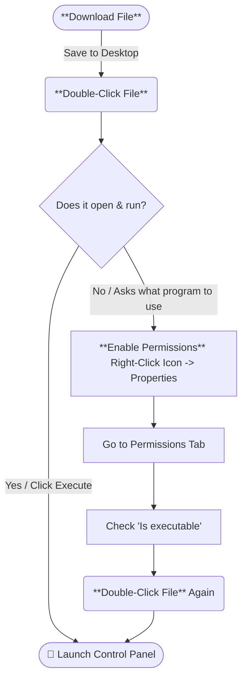

# 🛡️ SteamOS Dock Wake Utility & Time-Gate Shield

Let's be real for a second: out of the box, you can't just slap a button on your wireless controller and wake your Steam Deck up while it's sitting across the room in its dock.

Now, there are scripts floating around the internet that try to fix this. The problem? They use the "shotgun method." They loop through your entire `lsusb` topology and indiscriminately enable the wake attribute for *every single USB device and root hub* connected to your machine. It works... until you notice your Deck has turned into a total insomniac. Because everything is armed to wake the system, your Deck starts randomly waking up in its case, turning on in the middle of the night, or draining its battery because a background system node blinked.

This utility is the surgical solution to that problem.

## 🎨 Friendly, Native GUI Control Panel

Forget messy terminal commands or confusing text files. This manager features a **fully interactive graphical interface (GUI)** using native SteamOS desktop windows. It is built to be completely approachable for inexperienced users, turning complex system configurations into a visual, click-and-go dashboard.

* **Real-Time Status Dashboard:** The main window displays your exact system metrics—including your active shield guard threshold and a color-coded connected hardware survey showing which devices are **Registered** (Green) or **Unregistered** (Orange).
* **Immutable Path Tracking:** Dynamically audits and displays the status of critical system overlays (`udev` rules and `sudoers` privileges) so you instantly know if a recent SteamOS update wiped them and requires a 2-second quick repair.
* **Charging Cradle Chaos Shield:** If you've ever put your Deck to bed, set your controller down to charge, and watched in horror as the Deck instantly wakes right back up—you've met the electrical handshake high-five. The dock handles the incoming voltage spike from your charging controller, panics, and blares a phantom connect signal straight up the pipe. This utility uses your Deck's built-in **Real-Time Hardware Clock (RTC)** to create an airtight time-gate. If an electrical spike forces the Deck awake before your guard threshold timer runs out, the shield says *"Nope, too early,"* and forces the Deck straight back into a deep sleep before it even has time to negotiate video out to your TV or monitor.

> [!NOTE]
> ### Obligatory Disclaimer:
> *I do not work for Valve, nor am I affiliated with them in any official capacity. I am just a developer who deeply respects Lord Gaben, his massive philanthropic contributions to the world, and the glorious hardware innovations he hath gifted mankind. I just wanted my dock to work right.*

> [!WARNING]
> *I am not responsible for you or the decisions you make, so if your Deck, or ROG, or Legion Go, or Microwave, or Tesla implode or stop working properly...*
>
> 

---

## 🚀 Two-Way Easy Installation

You don't need any prior Linux experience to get this running. Switch your Steam Deck to **Desktop Mode** and choose the method that makes you most comfortable:

### Method 1: The Downloadable Shortcut Shortcut (Easiest)


  
- ***Download:***  [📥 **Click here to Download the One-Click Installer**](https://github.com/boba-fatt/SteamDock_USB_Wake/raw/main/assets/Install_Dock_Wake_Manager.desktop?download=) and save it straight onto your **Desktop** 
- ***Run:*** Double-click the file and click **Execute** (or *Trust* if prompted). The launcher will handle the initial repository asset pull and fire up your control panel instantly!
- ***Enable Permissions:*** Right-click the downloaded icon on your desktop, select **Properties**, go to the **Permissions** tab, and check the box that says **"Is executable"**.
- ***Run Again:*** Double-click the file Again and click **Execute** (or *Trust* if prompted).

### Method 2: The Konsole One-Liner

If you prefer using the terminal, pop open `Konsole` and execute this single command:
```bash
curl -sSL https://bit.ly/3QZbWWh -o /tmp/manage_dock.sh && chmod +x /tmp/manage_dock.sh && /tmp/manage_dock.sh
```

🔑 "Not Everyone Knows How to Do Everything!" (Safe Password Setup)
A lot of people run their Steam Decks completely stock and have never set up an administrator (sudo) password. If that's you, don't panic. "Not everyone knows how to do everything! Driving isn't the only thing!"

> [!TIP]
> 

This manager handles the system security checks completely safely:

* **Quick How-do-ya-do:** The script checks if your account has a password. If it doesn't, a friendly window pops up explaining why SteamOS needs one to touch hardware settings.
* **The Hand-Holding Guide:** It suggests just using a simple standard password like `deck` so you can get moving, then throws you right into a secure terminal window running the native Linux `passwd` utility.
* 🔒 **The Lockbox Guarantee:** This utility never records, intercepts, logs, or saves your password anywhere. It stays 100% local, private, and sealed within your Deck's built-in Linux security layer.
> 

---
> [!CAUTION]
> *The following section is full of nerdy shit I have to kinda put in here, and I am not that great at explaining everything, so I did my best.  I am not a coder or an engineer; I am a dad who has to learn things in order to fix things because not everything is built for us, and I also value my sanity and comfort.*

## 🛠️ The Architecture (How This Whole Thing Actually Works)

Instead of building a messy, hardcoded blob that completely derails your system, this project is split into clean, modular layers. It's built to handle specific, chaotic problems without breaking the rest of the machine.

### 1. The Front-Facing Control Panel (`manage_dock.sh`)

This is the main graphical menu application. It uses a persistent layout loop so the window stays open smoothly while configuring options.

* **Brain-Fart Engine:** Look, we've all been there. You run the setup launcher on a total lapse of memory, completely forgetting that you already installed this months ago. The script doesn't get crossed-up, panic, crash, or double-install things. It quietly runs a background diagnostic, realizes everything is already working, reverse-engineers your active hardware rules, and smoothly auto-heals your setup without stepping on its own toes. It’ll even drop a fresh Application Launcher right back onto your Desktop so you can find it next time. No more asking "How do we move our bodies ever?"

### 2. The Central Configuration Layer (`dock_wake.conf`)

This is the single source of truth. It's a flat text database that holds your precise hardware descriptions and preference metrics. Your background execution scripts read from this directly. That means you can change your guard timer or uncheck a hub in the GUI, and the change takes effect instantly without modifying a single line of actual code. It treats the wizard as the absolute source of truth—unchecking a hub instantly purges it from your active rules configuration.

### 3. The Hardware Epoch Time-Gate (`99_dock_wake_delay.sh`)

This is the muscle. Other scripts on the internet use a heavy-handed shotgun method—indiscriminately enabling wake attributes for every single USB node they can find. It completely ruins the system's peace. You just want your Steam Deck to lay down, be by itself, and read its art books in suspend mode. But because those generic scripts armed every single port on the board, the second a controller drops onto a charging cradle, the resulting voltage spike acts like a pack of rogue contractors running around your system as fast as they can, jumping over your couches and forcing the Deck to wake up constantly.

To make matters worse, it messes up the handshake chain so badly that when you actually want to wake the system up normally with a peripheral, you're practically yelled at because your controller is suddenly "not part of the Turbo Team." You end up waking up the next day just to discover that the generic code effectively replaced your functional sleep cycle with a joke hole just for farts.

This script fixes that exact nightmare. The exact millisecond your Deck goes to sleep, a **Pre-Suspend Hook** stamps the exact bedtime to your storage disk. On an accidental hardware-level wake trigger, the **Post-Wake Hook** evaluates the current timestamp against that bedtime. If it is less than your safety threshold, it forces the system gracefully straight back to sleep before your TV can even register an input change.

### 4. The Background Service (`dock-wake-shield.service`)

This is the background automation layer that keeps the entire routine running. It's a dedicated user-space `systemd` daemon tied directly to your Deck's power states. Because it registers and loads entirely inside your unprotected user home space (`/home/deck/`), it completely survives major SteamOS system updates without requiring you to unlock the root partition. It's stable, reliable, and completely out of sight.

---

## 📐 Customizing Your Guard Threshold

Everyone's desk layout and charging docks are a little different. The manager configuration panel gives you total control over how the shield calculates fake wake events:

* **The Slider:** A quick visual slider scaling from `0` to `30` seconds for standard use cases.
* **Advanced Manual Mode:** Supports custom intervals up to `120` seconds (2 full minutes) for slow-stabilizing power supplies or accessibility layouts.
* **🛑 The Absolute Off Switch:** Setting the threshold to exactly **`0` seconds completely disables the shield layer.** The utility will step out of the way and allow all wake triggers to pass through immediately without mathematical evaluation.
* **👑 Physical Power Button Override:** No matter how high you set your guard timer, pressing the physical hardware power button on the top of the Steam Deck always overrides the shield. The script detects the `pwrbtn` hardware event signature on wake and instantly opens your USB ports without evaluating timestamps, meaning you will *never* get locked out of your machine by a long timer.
